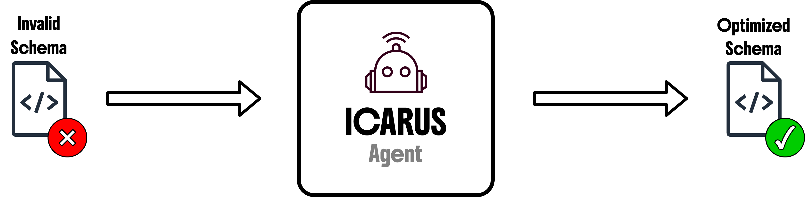
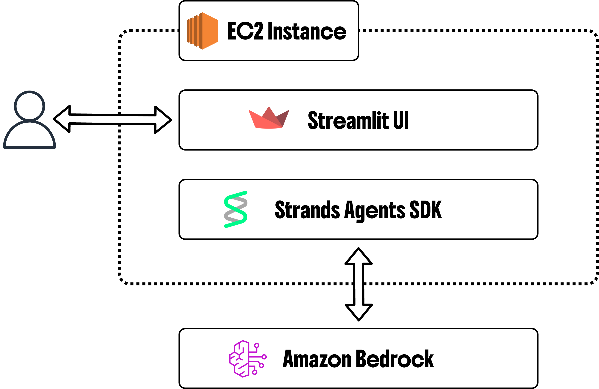

# ICARUS: Schema Support Agent for Interactive AgentCore Gateway Configuration



## 📋 Overview

ICARUS is an AI agent that automatically fixes OpenAPI specifications for AgentCore Gateway compatibility. It transforms legacy specs to OpenAPI 3.0, resolves validation errors, and ensures Gateway-specific requirements are met, reducing integration time from days to hours.

Interact with the agent to create focused sub-schemas from large APIs (filtering 100s of endpoints to specific components) and improve API descriptions to make them more AI-agent friendly.

**Key Features:**

- 🔄 Automated schema conversion and repair
- ⚡ Real-time validation with iterative fixes
- 🛠️ Interactive agent with specialized tools
- 🎯 Focused sub-schema extraction from large APIs
- 📝 AI-enhanced descriptors for agent optimization
- 🚀 One-click solution for complex API migrations

## 🚀 Quick Start

All deployment and management commands are available as `make` targets in the [Makefile](Makefile) for easy, one-click deployment.

**Prerequisites:**

- AWS account enabled with Bedrock access
- [AWS CLI](https://docs.aws.amazon.com/cli/latest/userguide/getting-started-install.html) configured with valid credentials (`AWS_ACCESS_KEY_ID` etc.)
- [AWS Systems Manager Session Manager plugin](https://docs.aws.amazon.com/systems-manager/latest/userguide/session-manager-working-with-install-plugin.html)

**Deploy:**

> **IMPORTANT:** Ensure your AWS credentials are loaded into the environment before running any commands below.

```bash
# Deploy the application (create EC2 instance with web application)
make deploy

# Wait for deployment to complete
make wait

# Access the application via SSH tunnel
make session LOCAL_PORT=8080
# Then open http://localhost:<LOCAL_PORT> in your browser
```

The `deploy` command provisions all necessary AWS resources via CloudFormation. Use `make wait` to monitor completion (deployment takes ~5 minutes). Once deployed, use `make session` to create a secure SSH tunnel via Session Manager plugin and access the application locally.

**Optional Configuration:**

```bash
make deploy \
    STACK_NAME=icarus-app \
    REGION=us-west-2 \
    INSTANCE_TYPE=t3.medium
```

**Cleanup:**

```bash
# Delete all resources
make delete
```

## 🏗️ Architecture



ICARUS is built using the [Strands Agent SDK](https://github.com/strands-agents/sdk-python) and deployed on AWS infrastructure (see [cfn.yaml](cfn.yaml)):

- **Amazon Bedrock** - Powers the AI agent with foundation models
- **Amazon EC2** - Hosts the web application and agent runtime
- **AWS Systems Manager** - Provides secure access via Session Manager plugin
- **Amazon CloudWatch** - Provides logging and monitoring
- **Amazon S3** - Stores application code and artifacts
- **AWS IAM** - Manages permissions and access control
